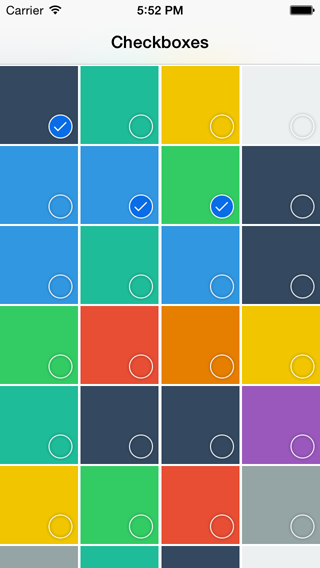

CollectionViewCheckbox
======================

A sample project with checkbox support in collection views

Merge current master to Swift-3.0 branch, and make it compilable with Xcode 8.0.

Swift 3 Support.

